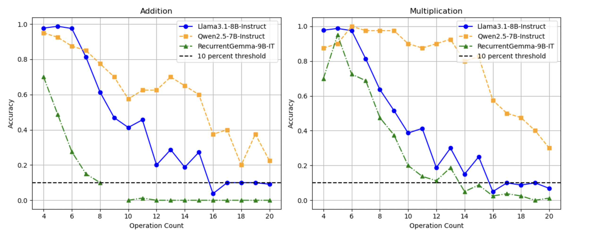
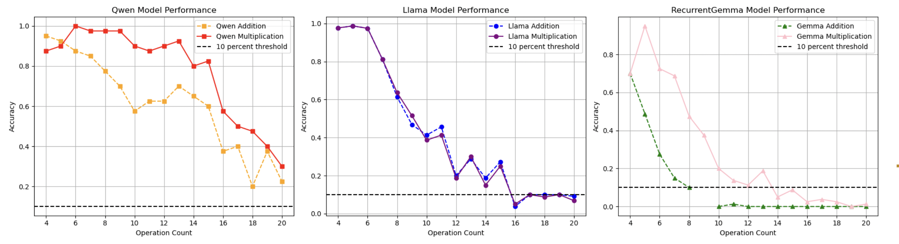
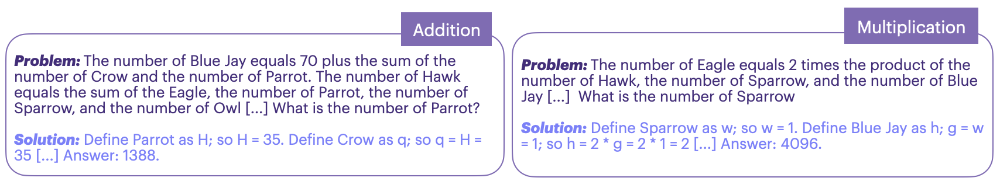

# LLM Arithmetic Study

This repository contains the code, data, and report for our CS224N (Natural Language Processing with Deep Learning) project at Stanford University, titled **"Do Language Models Count Like We Do? A Study of Arithmetic Operations"**. We investigate how large language models (LLMs) handle isolated arithmetic tasks (addition and multiplication) using controlled benchmarks adapted from the GSM-∞ framework.

## Project Overview

We evaluate three LLMs—Llama-3.1-8B-Instruct, Qwen-2.5-7B-Instruct, and RecurrentGemma-9B-IT—on arithmetic problems with varying complexity levels (4 to 20 operations). Key findings:
- Qwen and RecurrentGemma outperform on multiplication compared to addition, unlike human tendencies.
- Errors include computational mistakes, dependency tracking issues, and state decay over long sequences.
- These patterns suggest LLMs process arithmetic differently from humans, highlighting numerical reasoning limits.

Below is a performance comparison of the three models across complexity levels:


*Figure: Performance of Llama-3.1-8B-Instruct, Qwen-2.5-7B-Instruct, and RecurrentGemma-9B-IT on addition and multiplication tasks, showing accuracy decline with increasing complexity.*

Operation-specific differences are also evident:


*Figure: Model-specific performance on addition vs. multiplication, highlighting Qwen and RecurrentGemma's preference for multiplication.*

## Repository Structure

- `gemma/`: Scripts for RecurrentGemma-9B-IT evaluation.
  - Run `evaluategemmarnn.sh` to evaluate RecurrentGemma on arithmetic tasks.
- `realistic/`: Scripts for Llama-3.1-8B-Instruct and Qwen-2.5-7B-Instruct evaluation.
- `monotoneops/`: Data generation scripts for arithmetic problems (addition and multiplication).
<!-- - `report/`: Final project report (`final_report.pdf`) and LaTeX source (`final_report.tex`). -->
- `figures/`: Figures used in the report, including computational graphs and performance plots.

## Datasets

Our generated datasets are available on Hugging Face:
- Addition: [operations_plus](https://huggingface.co/datasets/Yunong/operations_plus)
- Multiplication: [operation_times](https://huggingface.co/datasets/Yunong/operation_times)

Example problems from our datasets are shown below:


*Figure: Examples of addition and multiplication problems at different complexity levels.*

## Setup Instructions

1. **Clone the Repository**:
   ```bash
   git clone https://github.com/your-username/llm-arithmetic-study.git
   cd llm-arithmetic-study
   ```
**Note:** API access is required for Llama-3.1-8B-Instruct and Qwen-2.5-7B-Instruct. RecurrentGemma evaluation requires GPU hardware (e.g., NVIDIA L40).
2. **Prepare Data**:
Use scripts in monotoneops/ to generate arithmetic problems:
```bash
cd monotoneops
bash test_generate3.sh
```
## Usage

### Evaluate RecurrentGemma:
Navigate to the gemma/ directory and run the evaluation script:
```bash
cd gemma
bash evaluategemmarnn.sh
```
Ensure GPU access and model weights are available.
### Evaluate Llama and Qwen:
Scripts are in realistic/. Example for Llama:
```bash
cd realistic
python ./pred/pred.py
```
Requires API access for Llama and Qwen models.


## Authors
Yunong Liu (yunongl@stanford.edu)  
Xinyu Chang (creasa09@stanford.edu)  
Olivia Feng (jyfeng19@stanford.edu)  

## Acknowledgments
Mentor: Mingjian Jiang  
Course: CS224N, Stanford University (Winter 2025)  
Framework: A significant portion of this project, including problem generation and evaluation scripts, is adapted from [GSM-∞ by Zhou et al.](https://github.com/Infini-AI-Lab/gsm_infinite/tree/main/gsm-infinite) (2025)  


